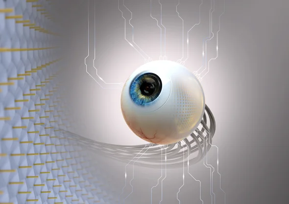

```{r setup, include=FALSE}
knitr::opts_chunk$set(echo = FALSE)
```



This post is an analysis of analysis of: [New artificial eye mimics a retina's natural curve](https://www.scientificamerican.com/article/new-artificial-eye-mimics-a-retinas-natural-curve/) .

### Number of word and date of publication: 753, 20 may 2020 

## Vocabulary:


## Analysis table:

