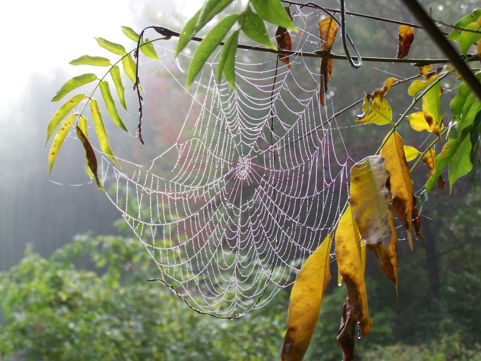

```{r setup, include=FALSE}
knitr::opts_chunk$set(echo = FALSE)
```



This post is an analysis of analysis of: [creation of a new  plastic synthetic material based on spider webs](https://phys.org/news/2020-11-plastic-webs-cellphone-screens-future.html) 

### Number of word and date of publication: 482, 2 november 2020

## Vocabulary:
| word from the text | synonym/ definition                 | French translation     |
| ------------------ | ----------------------------------- | ---------------------- |
| glass pane         | a plate more or less thick of glass | vitre                  |
| polycarbonate      | a type of plastic                   | polycarbonate          |
| extruded           | force out                           | faire sortir / extrudé |
| intertwined        | twine together                      | entrelacé              |

## Analysis table:
| Researchers ?                   | Professors Frédérick Gosselin and Daniel Therriault from Polytechnique  Montréal's Department of Mechanical Engineering, along with doctoral  student Shibo Zou                                                                                                                                                                                                        |
| ------------------------------- | ---------------------------------------------------------------------------------------------------------------------------------------------------------------------------------------------------------------------------------------------------------------------------------------------------------------------------------------------------------------------- |
| Published in ? When ?           | In Cell Reports Physical Science the 18 November 2020                                                                                                                                                                                                                                                                                                                  |
| General topic ?                 | The creation of a material which combine both propriety of poly-carbonate and spider web.                                                                                                                                                                                                                                                                               |
| Procedure / What was examined ? | They use 3-d printer to create a thin mesh of poly-carbonate where every layer is perpendicular to the previous one. And also, as the flux of poly-carbonate is very slow, when the poly-carbonate cool, it have a tendency to form a succession of loop which provide the resistance. The overall structure can be compare to a chain-mail.                           |
| Conclusion/ discovery ?         | The new material can absorb 93% of the energy of impacts without breaking due to sacrificial link which break when impacts occurred, thus the overall structure are preserve .This discovery could be the opening for a new generation of  bullet-proof glass or protective smartphone screen or other application which have for vocation protection and resistance.   |
