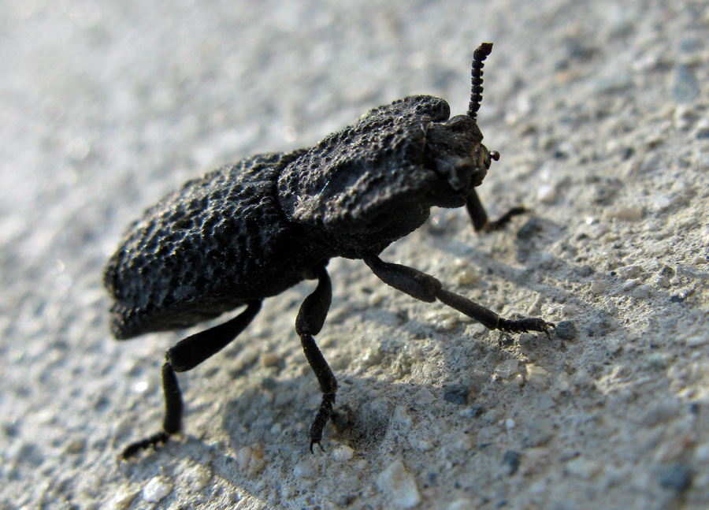

```{r setup, include=FALSE}
knitr::opts_chunk$set(echo = FALSE)
```



This post is an analysis of analysis of: [You can't squish this 'iron' beetle. Now, scientists know why.](https://www.livescience.com/unbreakable-beetle.html) .

### Number of word and date of publication: 486, 21 october 2020

## Vocabulary:
| Word from the text | Synonym/ Definition                                            | French translation |
| ------------------ | -------------------------------------------------------------- | ------------------ |
| forewings          | it is the pair of wings which is place the nearest of the head | l'aile antérieur   |
| scamper away       | run away                                                       | fuir               |
| jigsaw design      | something with a form of puzzle                                | en forme de puzzle |
|  stiff             | rigid                                                          | rigide             |

## Analysis table

| Researcher ?                    | Jesus Rivera, Maryam Sadat Hosseini, David Restrepo, Satoshi Murata4, Drago  Vasile, Dilworth Y. Parkinson, Harold S. Barnard, Atsushi Arakaki,  Pablo Zavattieri & David Kisailus ( found in the publication in Nature)                                                                                                                                                                                                                                                                                                                                                                       |
| ------------------------------- | ---------------------------------------------------------------------------------------------------------------------------------------------------------------------------------------------------------------------------------------------------------------------------------------------------------------------------------------------------------------------------------------------------------------------------------------------------------------------------------------------------------------------------------------------------------------------------------------------- |
| Published in ? When ?           | 21 October 2020 in Nature                                                                                                                                                                                                                                                                                                                                                                                                                                                                                                                                                                      |
| General topic ?                 | the stiffness and resistance of iron beetles shell                                                                                                                                                                                                                                                                                                                                                                                                                                                                                                                                             |
| Procedure / what was examined ? | they examined the structure of the shell and how the connection between elytres is made                                                                                                                                                                                                                                                                                                                                                                                                                                                                                                        |
| Conclusion / Discovery ?        | they found that there are lateral support structure which increase the stiffness in some place of the shell and help in the distribution of weight in case of choc. Also, the jigsaw design and the increase of number of connections between elytres rise the global resistance. This discovery as been tested on a 3D printed model, and the results show that the joint of the model are more tough than common engineering joint.  For this reason, maybe in the future engineers will mimic the biological structure of iron beetles elytres  to create new impact-resistance structures. |
