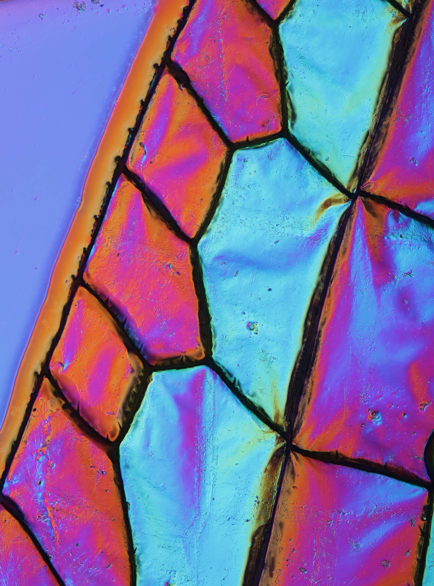

```{r setup, include=FALSE}
knitr::opts_chunk$set(echo = FALSE)
```



This post is an analysis of analysis of: [Insect wings inspire new ways to fight superbugs](https://www.sciencedaily.com/releases/2020/08/200818103841.htm) 

### Number of word and date of publication: 472, 18 august 2020

## Vocabulary:
| Word from the text | synonym/definition                                          | French translation    |
| ------------------ | ----------------------------------------------------------- | --------------------- |
| superbugs          | a type of bacteria which can resist to a lot of antibiotics | bactéries résistantes |
| spurred            | inspired                                                    | inspiré               |

## Analysis table:
| Researchers                     | Denver P. Linklater, Vladimir A. Baulin, Saulius Juodkazis, Russell J. Crawford, Paul Stoodley, Elena P. Ivanova.                                                                  |
| ------------------------------- | ---------------------------------------------------------------------------------------------------------------------------------------------------------------------------------- |
| Published in ? When ?           | August 18, 2020 in nature reviews microbiology                                                                                                                                     |
| General topic                   | How micro-structure place on dragonflies and cicadas can have antibacterials effects and how we could use these structures to overcome our the increasing of super bugs infections |
| Procedure ?  What was examined  | they recreated these structures artificially and monitored their effectiveness on different type of bacteria                                                                       |
| Discovery / Remaining questions | they discovered than some structure are more effective on specific type of bacteria but they struggle to understand the mechanism which provoke the lysis of bacteria              |
