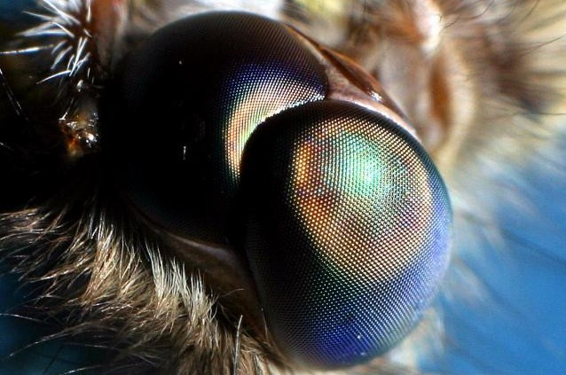

```{r setup, include=FALSE}
knitr::opts_chunk$set(echo = FALSE)
```



This post is an analysis of analysis of: [Mimicking moth eyes to produce transparent anti-reflective coatings](https://www.sciencedaily.com/releases/2020/11/201104150014.htm)

### Number of word and date of publication: 592, 4 novembre 2020

## Vocabulary:
| Word from the text  | Synonym/definition                               | French translation           |
| ------------------- | ------------------------------------------------ | ---------------------------- |
| bullet train        | a fast train                                     | un train à grande vitesse    |
| moth                | a type of butterfly                              | un papillon de nuit          |
| mold                | a receptacle used for giving a form to something | un moule                     |
| ecth glassy carbone | an ingraving on a glassy carbone surface         | gravures sur carbone vitreux |

## Analysis table:
| Researchers                      | Tomoya Yano, Hiroyuki Sugawara, Jun Taniguchi                                                                                                                                                                                                             |
| -------------------------------- | --------------------------------------------------------------------------------------------------------------------------------------------------------------------------------------------------------------------------------------------------------- |
| Published in ? When ?            | Micro and Nano Engineering in november 2020                                                                                                                                                                                                               |
| General topic                    | How and what are the applications for a bio anti reflective material inspire of moth eyes                                                                                                                                                                 |
| Procedure ?  What was examined   | They recreated the graded pattern of moth eyes and found a new production technique which is cheaper and more adapted to an industrial production ( inductively coupled plasma).                                                                          |
|  Discovery / Remaining questions | The production of this new material was a success, an improvement of the visibility of flat screen display like cellphone or computer are expected. Also, an improvement of solar panel productivity could be made due to the capability of the material. |
