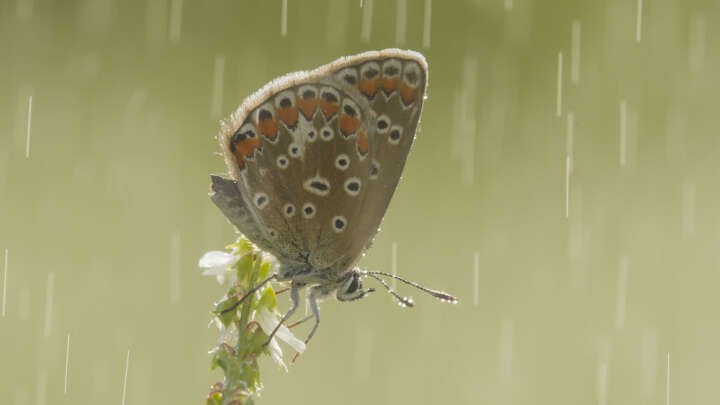

```{r setup, include=FALSE}
knitr::opts_chunk$set(echo = FALSE)
```



This post is an analysis of analysis of: [Armor on butterfly wings protects against heavy rain ](https://news.cornell.edu/stories/2020/06/armor-butterfly-wings-protects-against-heavy-rain)

### Number of word and date of publication: 579, 8 june 2020

## Vocabulary:
| Word from the text | Synonym/Definition             | French translation |
| ------------------ | ------------------------------ | ------------------ |
| veneers            | something you put on a surface | placages           |

## Analysis table:
| Researchers                     | Sunghwan “Sunny” Jung and Seungho Kim                                                                                                                                                                                                                                                                                                                                                                              |
| ------------------------------- | ------------------------------------------------------------------------------------------------------------------------------------------------------------------------------------------------------------------------------------------------------------------------------------------------------------------------------------------------------------------------------------------------------------------ |
| Published in ? When ?           | Published and the National Academy of Sciences, 8 June 2020                                                                                                                                                                                                                                                                                                                                                        |
| General topic                   | The ability of butterfly wings to deflect heavy rain                                                                                                                                                                                                                                                                                                                                                               |
| Procedure ? What was examined ? | They put different material like leaf, feather or insects and film the impact with high-speed camera of water-drops on their surfaces                                                                                                                                                                                                                                                                              |
| Discovery / remaining question  | They discovered that butterfly wings are covered of nano-metric layer of wax and microscopic bump. The combination of these two characteristics give to the surface of the wings a super-hydrophobic capability that protect butterfly from rain and hypothermia. This capability may be applicable on spay for shoes or clothes for giving  waterproof propriety or on wings plane to increase their aerodynamic. |
