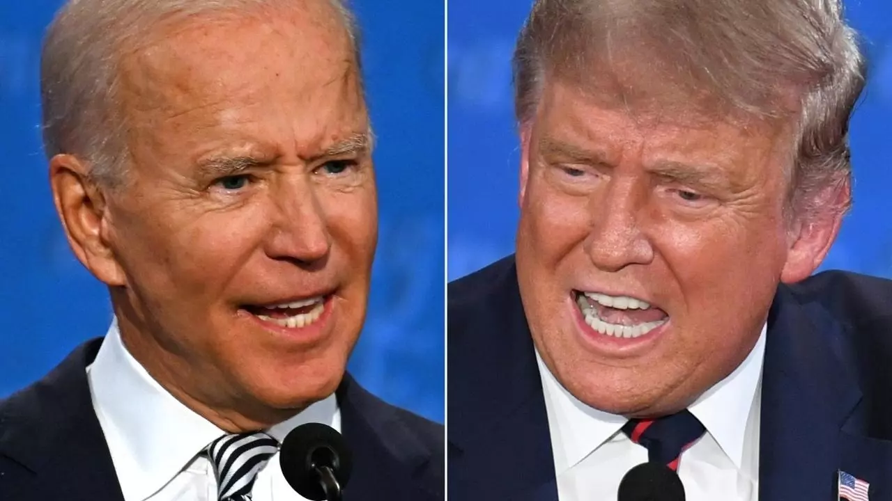
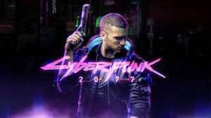

### Activities of 15 november 

 

Today I read an article in the BBC news which speak about the medialized U.S election. Finally Donald Trumps admit the obvious fact that he lost the election in his favorite social media ... Twitter. This news make me happy and I thought " great now he can move out and let Joe biden do the job he have to do", but of course even if it's the first time he recognizes his defeat, his ego can not accept that he lost the election in a fair way and bawl that the election was ridged even if there is nothing to confirm his comments. 

Another thing is that I begin a new series, " Peaky blinder". For what I saw, it is great, well scripted and there is a notable industrial revolution ambiance. I hope it will continue in the two others saisons. 

### Activities of 22 november.

A few days ago, the last trailer of much anticipated Cyberpunk 2077 has been released. And so, we now have to wait till the official release date of 10 december 2020 to have further information. But why is this game so much long-awaited by fans, game industries and by me ? 

### It's a promise of liberty

For what I saw, this game is outstanding on every aspect of a RPG game. Graphics are virtually real due to a excellent artistic direction and ray tracing, facial expression are customized for every single language supported by the game thanks to motion capture. And, finally, maybe the most important point, the density of the world is greater than every other game of this type. In fact, you can interact with almost every pnj that you encounter, and all of them have goals, character, and biases about you or the world around them. This game is much more than an empty world with quest and guns, it is a promise of liberty, that I hope will force the concurrent to improve their standards and lead to a new generation of open worlds.

### A dystopian world but not all that far of ours world

Cyberpunk 2077 take place in a world where after a nucleare war, the big corporations took control of the last megalopolis, night city. And as we could expect, this situation bring to a rupture where the poor creep in the dirt, cold, violence and somehow or other stay alive. When in the same time, the corporation show off their luxury and consume as much as they can. But in our world, is this not already the case ? Of course, it is not as extreme as in the game but when we think about it, if war occurred the GAFA could be our next leaders.

