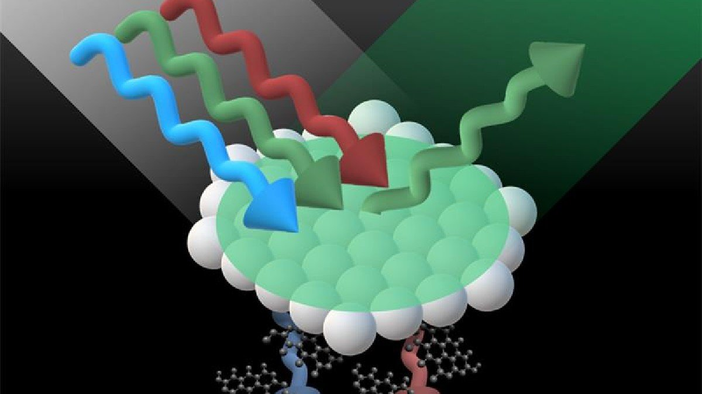

```{r setup, include=FALSE}
knitr::opts_chunk$set(echo = FALSE)
```




This post is an analysis of Analysis of: [Pretty as a peacock : The gemstone for the next generation of smart sensors](https://www.surrey.ac.uk/news/pretty-peacock-gemstone-next-generation-smart-sensors) . 

### Number of word and date of publication: 638, 19 may 2020

## Vocabulary: 
| word from the text   | synonym/ definition                                                  | French translation |
| -------------------- | -------------------------------------------------------------------- | ------------------ |
| peacock              | It’s a bird witch show his multicolour tail to impress females       | Paon               |
| strain               | It’s the force in a rope when two men pull each one , one extremity  | tension            |
| anti-counterfeiting  | It’s something that prevent other person to copy                     | anti-contrefaçon   |
| scaffolds            | It’s the structure of something                                      | support            |

## Analysis table

| Researchers ?                | An international team led by the universities of surrey                                                                                                                                                                                                                                                                                        |
| ---------------------------- | ---------------------------------------------------------------------------------------------------------------------------------------------------------------------------------------------------------------------------------------------------------------------------------------------------------------------------------------------- |
| Published in ? When ?        | Advanced Functional Materials                                                                                                                                                                                                                                                                                                                  |
| General topic                | The creation of a new photonic crystal based on the addition of graphene                                                                                                                                                                                                                                                                       |
| Procedure/ what was examined | The took their inspiration on the vast range of colour on the tail of peacocks and beetle shells, witch come from the molecular structure and not pigmentation                                                                                                                                                                                 |
| Conclusion/ discovery        | The new crystal can : indicate if they were expose to a rise of temperature (useful for perishable food), keep the shape in memory and react when expose to pressure, interact with virus and serve like a bioindicator, be use like a body sensors for sportive activity or hand-washing indicator and all of that for a relatively low cost. |
| Remaining question           | /                                                                                                                                                                                                                                                                                                                                              |
